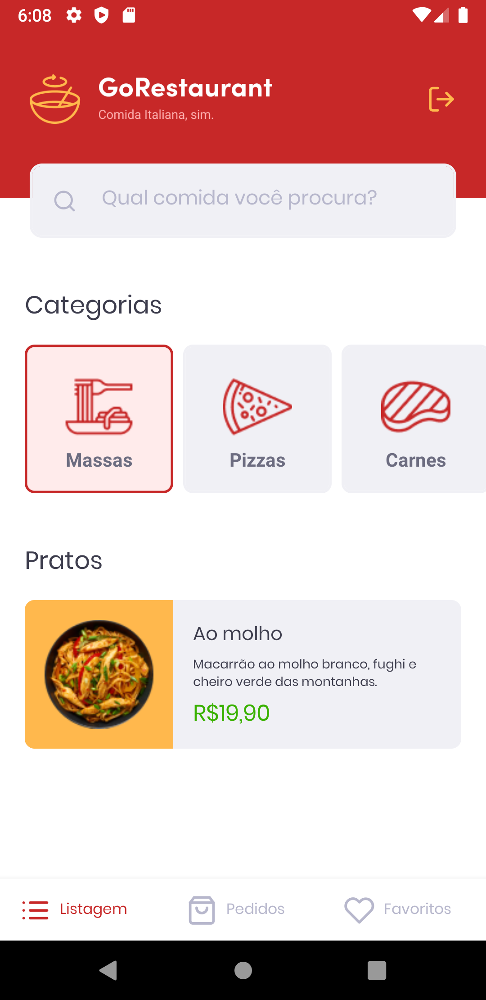

<h1 align="center">
  

    
  

</h1>

  

  

  

  <a href="https://github.com/sirmd">
    
  <a>

## Description
  - Application developed as a challenge for the GoStack Bootcamp 2020.

## Demonstration 📱

  

  
  
  
  
  
  
  

## Knowledges Applied 🚀
 - React Native
 - Styles with Styled Components
 - React Navigation with Stack Navigator and Bottom Tabs Navigator
 - Fake API with JSON server
 - Automated tests with jest
 
## Results 🤞
<h1 align="center">
  
  
</h1>

## Credits 👏
  - <a target="_blank" href="https://rocketseat.com.br">Rocketseat</a>

## Contact ✉
  - <a target="_blank" href="https://www.linkedin.com/in/mateus-campos-deitos-42688864//">LinkedIn</a>
  - <a target="_blank" href="mailto:matdeitos@gmail.com">E-mail</a>
